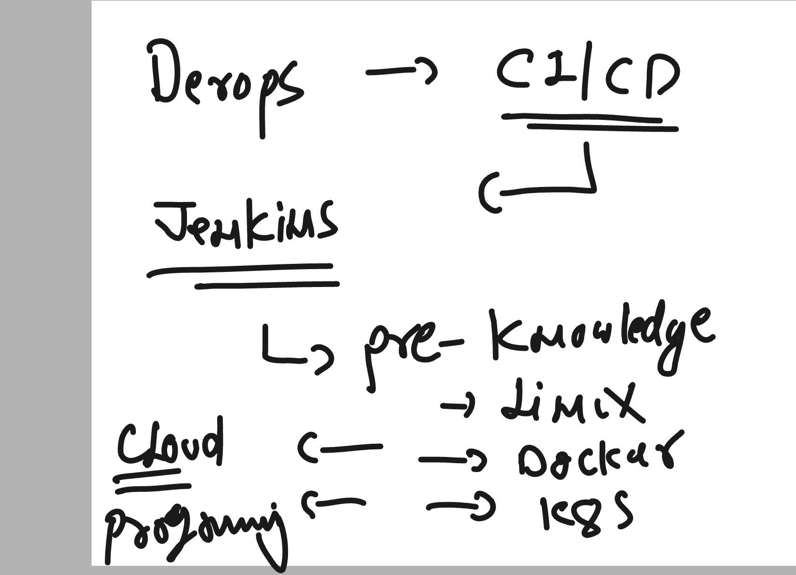
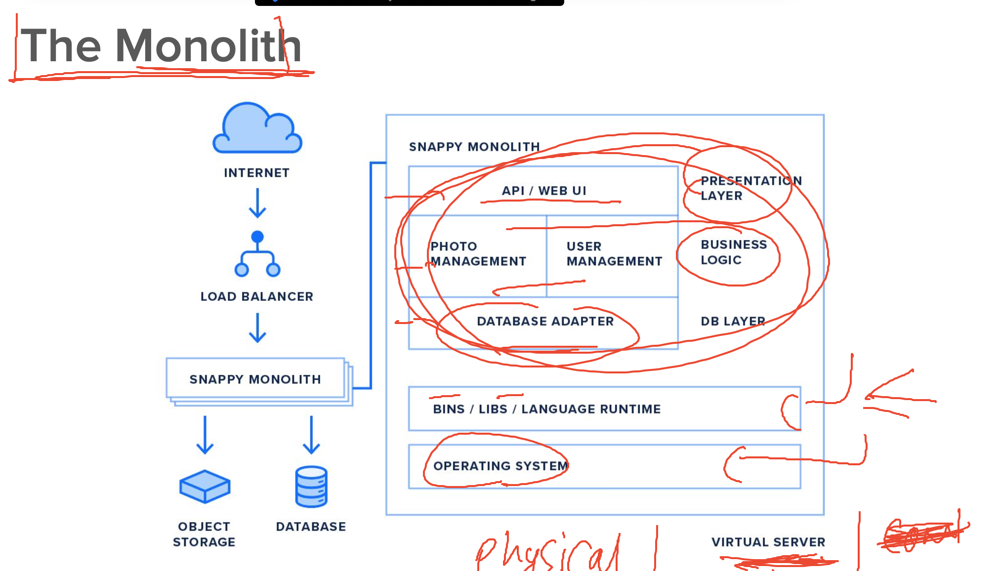
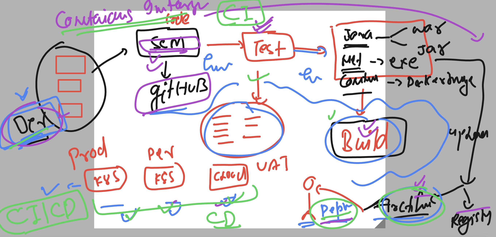
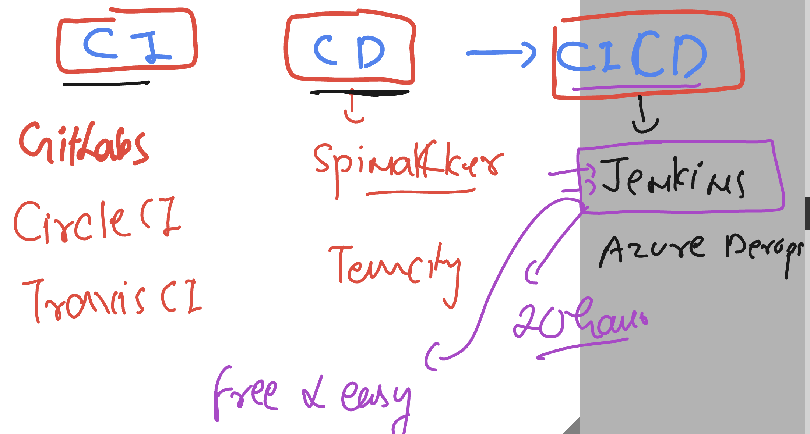

# cloud4c-jenkinsb2

### Course intro 



### app design and depoyment model 

### monolith model 




### Introduction to micro services


### Introduction of CI & CD 



## Jenkins is our target 



### Login to your personal linux remote machine using ssh

```
➜  ~ cd  Downloads 
➜  Downloads 
➜  Downloads 
➜  Downloads chmod 400 ashu-jenkins-b2key.pem
➜  Downloads ssh -i "ashu-jenkins-b2key.pem" ec2-user@ec2-54-152-181-77.compute-1.amazonaws.com
The authenticity of host 'ec2-54-152-181-77.compute-1.amazonaws.com (54.152.181.77)' can't be established.
ED25519 key fingerprint is SHA256:27raN9Ad0jtbjauhyj51y2HVxk0IziHVVbTU0OJZ7vU.
This key is not known by any other names
Are you sure you want to continue connecting (yes/no/[fingerprint])? yes
Warning: Permanently added 'ec2-54-152-181-77.compute-1.amazonaws.com' (ED25519) to the list of known hosts.

       __|  __|_  )
       _|  (     /   Amazon Linux 2 AMI
      ___|\___|___|

https://aws.amazon.com/amazon-linux-2/
-bash: warning: setlocale: LC_CTYPE: cannot change locale (UTF-8): No such file or directory
[ec2-user@ip-172-31-49-102 ~]$ 
[ec2-user@ip-172-31-49-102 ~]$ 
[ec2-user@ip-172-31-49-102 ~]$ whoami
ec2-user
[ec2-user@ip-172-31-49-102 ~]$ sudo -i
[root@ip-172-31-49-102 ~]# whoami
root
[root@ip-172-31-49-102 ~]# 


```
