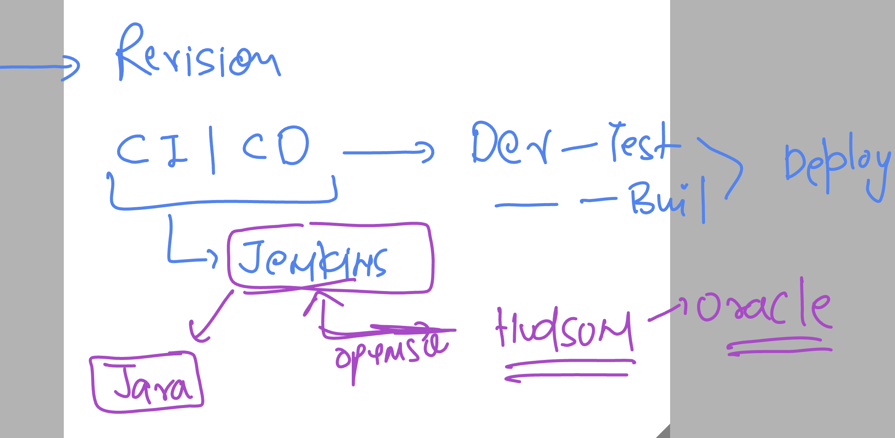
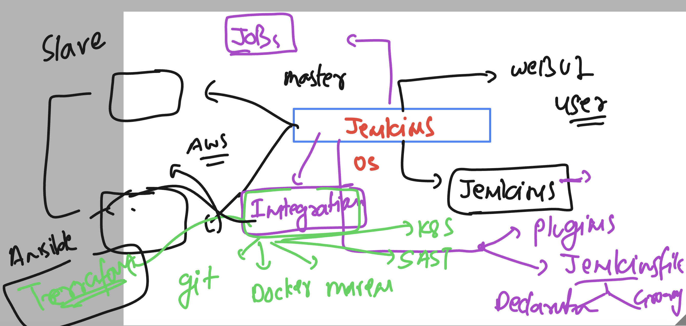
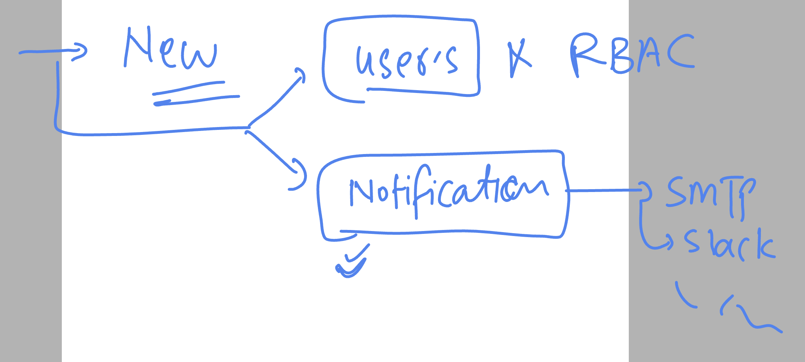
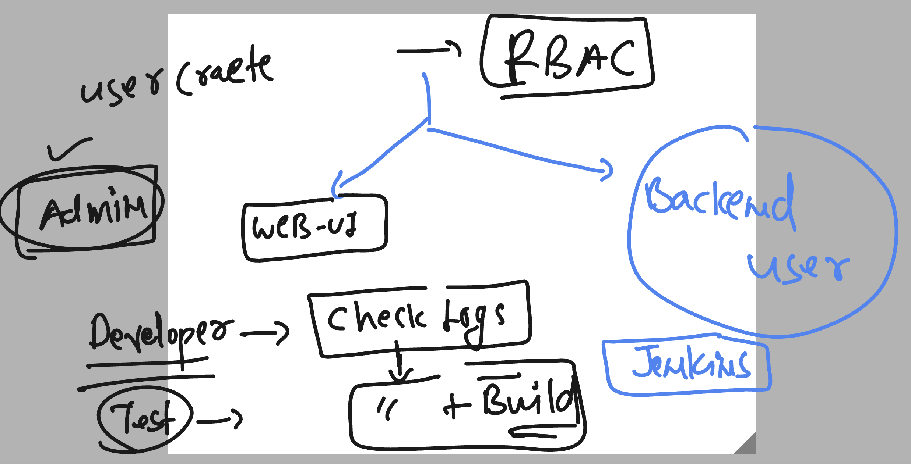

# cloud4c-jenkinsb2

### Rev 1



### revision 2



### user and notification service 



### RBAC 



## Notification & alert 

### SMTP 


### jenkisfile job

```
pipeline {
    agent any

    stages {
        stage('Hello') {
            steps {
                echo 'Hello World'
            }
        }
        stage('testing docker connection'){
            steps {
                echo 'testing connection of docker'
                sh 'docker version'
                sleep 3 
                // i want to send an email notication about docker successfull connection
                mail bcc: '', body: '''yeahhhh ohhhhhhhhhhh!!
we got docker connection established hurrrahh''', cc: 'navinyab95@gmail.com', from: '', replyTo: '', subject: 'docker testing status', to: 'ashutoshh@delvex.io'
                
            }
        }
    }
}


```

### putting email notification in post section 

```
pipeline {
    agent any

    stages {
        stage('Hello') {
            steps {
                echo 'Hello World'
            }
        }
        stage('testing docker connection'){
            steps {
                echo 'testing connection of docker'
                sh 'docker version'
                sleep 3 
                // i want to send an email notication about docker successfull connection
            }
        }
        stage('testing kubernetes api-resources'){
            steps {
                echo 'lets check ingress controller deployment status'
                sh 'kubectl  check ingress -n ingress-nginx'
            }
        }
    }
    post {
        success {
            echo 'hey got it'
        }
        failure {
            echo 'drafting email'
            script {
                def subject1 = "Build Status: ${currentBuild.currentResult}"
                def body1 = """
                            <p>Build Status: ${currentBuild.currentResult}</p>
                            <p>Build Number: ${env.BUILD_NUMBER}</p>
                            <p>Build URL: ${env.BUILD_URL}</p>
                           """
                def to1 = "ashutoshh@delvex.io"
                def from1 = "asashuthegreat4@gmail.com"
                mail (
                    to: to1,
                    from: from1,
                    subject: subject1,
                    body: body1,
                    )
            }
        }
    }
}

```

### easiest way to integration jenkins + k8s

```
root@ip-172-31-49-102 ~]# grep jenkins /etc/passwd
jenkins:x:995:993:Jenkins Automation Server:/var/lib/jenkins:/bin/bash
[root@ip-172-31-49-102 ~]# 
[root@ip-172-31-49-102 ~]# 
[root@ip-172-31-49-102 ~]# 
[root@ip-172-31-49-102 ~]# mkdir  /var/lib/jenkins/.kube
[root@ip-172-31-49-102 ~]# cd   /var/lib/jenkins/.kube
[root@ip-172-31-49-102 .kube]# ls
[root@ip-172-31-49-102 .kube]# wget  http://3.130.106.53/admin.conf 
--2023-06-30 13:04:05--  http://3.130.106.53/admin.conf
Connecting to 3.130.106.53:80... connected.
HTTP request sent, awaiting response... 200 OK
Length: 5640 (5.5K) [text/plain]
Saving to: 'admin.conf'

100%[===================================================================================================================>] 5,640       --.-K/s   in 0s      

2023-06-30 13:04:05 (390 MB/s) - 'admin.conf' saved [5640/5640]

[root@ip-172-31-49-102 .kube]# ls
admin.conf
[root@ip-172-31-49-102 .kube]# mv admin.conf config
[root@ip-172-31-49-102 .kube]# 


```
