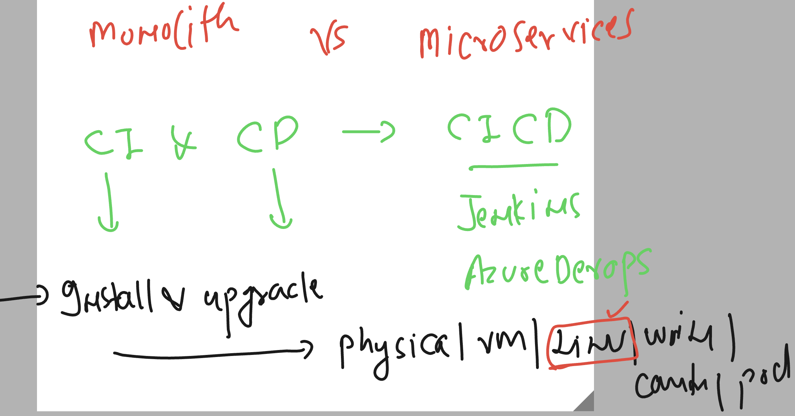

# cloud4c-jenkinsb2

### Revision 



## Installing Jenkins 

### Step 1 -- updating software repo 

```
[ec2-user@ip-172-31-49-102 ~]$ sudo yum update –y
Failed to set locale, defaulting to C
Loaded plugins: extras_suggestions, langpacks, priorities, update-motd
amzn2-core                                                                                                            | 3.7 kB  00:00:00     
No Match for argument: –y
No packages marked for update

```

### step 2 --create jenkins software repo 

```
[ec2-user@ip-172-31-49-102 ~]$ sudo wget -O /etc/yum.repos.d/jenkins.repo \
>     https://pkg.jenkins.io/redhat-stable/jenkins.repo
--2023-06-20 11:58:34--  https://pkg.jenkins.io/
```

### step 3 -- loading license key 

```
sudo rpm --import https://pkg.jenkins.io/redhat-stable/jenkins.io-2023.key
```

###  step 4 Installing jdk 11 

```
ec2-user@ip-172-31-49-102 ~]$ sudo amazon-linux-extras install java-openjdk11 -y
Installing java-11-openjdk
Failed to set locale, defaulting to C
Loaded plugins: extras_suggestions, langpacks, priorities, update-motd
Cleaning repos: amzn2-core amzn2extra-docker amzn2extra-java-openjdk11 amzn2extra-kernel-5.10 jenkins
19 metadata files removed
8 sqlite files removed
0 metadata files removed
Failed to set locale, defaulting to C
Loaded plugins: extras_suggestions, langpacks, priorities, update-motd
amzn2-core                                                                                                            | 3.7 kB  00:00:00     
amzn2extra-docker                                                                                                     | 3.0 kB  00:00:00     
amzn2extra-java-openjdk11                                                                                             | 3.0 kB  00:00:00     
amzn2extra-kernel-5.10                                                                                                | 3.0 kB  00:00:00     
jenkins                                                                                                               | 2.9 kB  00:00:00     
(1/10): amzn2-core/2/x86_64/group_gz                                                                                  | 2.5 kB  00:00:00     
(2/10): amzn2-core/2/x86_64/updateinfo                                                                                | 629 kB  00:00:00     
(3/10): amzn2extra-java-openjdk11/2/x86_64/primary_db                                                                 | 160 kB  00:00:00     
(4/10): amzn2extra-kernel-5.10/2/x86_64/updateinfo   
```

### verify jdk installation 

```
[ec2-user@ip-172-31-49-102 ~]$ java -version 
openjdk version "11.0.19" 2023-04-18 LTS
OpenJDK Runtime Environment (Red_Hat-11.0.19.0.7-1.amzn2.0.1) (build 11.0.19+7-LTS)
OpenJDK 64-Bit Server VM (Red_Hat-11.0.19.0.7-1.amzn2.0.1) (build 11.0.19+7-LTS, mixed mode, sharing)


```

### step 5 Installing jenksin

```
sudo yum install jenkins -y
```

### verify it 

```
[ec2-user@ip-172-31-49-102 ~]$ rpm -qa jenkins*
jenkins-2.401.1-1.1.noarch
[ec2-user@ip-172-31-49-102 ~]$ 
[ec2-user@ip-172-31-49-102 ~]$ 
[ec2-user@ip-172-31-49-102 ~]$ rpm -qc jenkins
/etc/init.d/jenkins
/etc/logrotate.d/jenkins
/etc/sysconfig/jenkins

```

### step 6 --starting service of jenkins 

```
[ec2-user@ip-172-31-49-102 ~]$ sudo systemctl start jenkins
[ec2-user@ip-172-31-49-102 ~]$ sudo systemctl enable  jenkins
Created symlink from /etc/systemd/system/multi-user.target.wants/jenkins.service to /usr/lib/systemd/system/jenkins.service.
[ec2-user@ip-172-31-49-102 ~]$ 
[ec2-user@ip-172-31-49-102 ~]$ sudo systemctl status  jenkins
● jenkins.service - Jenkins Continuous Integration Server
   Loaded: loaded (/usr/lib/systemd/system/jenkins.service; enabled; vendor preset: disabled)
   Active: active (running) since Tue 2023-06-20 12:05:58 UTC; 32s ago
 Main PID: 5106 (java)
   CGroup: /system.slice/jenkins.service

```

