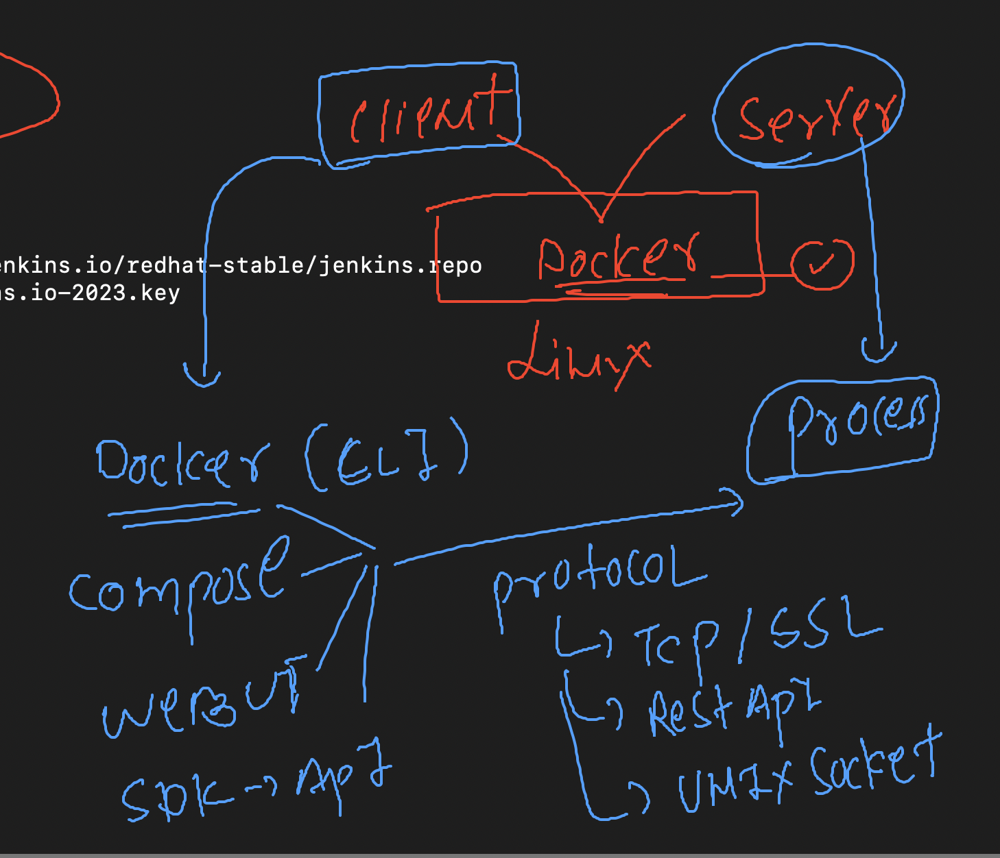

# cloud4c-jenkinsb2

### Revision 


## Installing Jenkins 

### Step 1 -- updating software repo 

```
[ec2-user@ip-172-31-49-102 ~]$ sudo yum update –y
Failed to set locale, defaulting to C
Loaded plugins: extras_suggestions, langpacks, priorities, update-motd
amzn2-core                                                                                                            | 3.7 kB  00:00:00     
No Match for argument: –y
No packages marked for update

```

### step 2 --create jenkins software repo 

```
[ec2-user@ip-172-31-49-102 ~]$ sudo wget -O /etc/yum.repos.d/jenkins.repo \
>     https://pkg.jenkins.io/redhat-stable/jenkins.repo
--2023-06-20 11:58:34--  https://pkg.jenkins.io/
```

### step 3 -- loading license key 

```
sudo rpm --import https://pkg.jenkins.io/redhat-stable/jenkins.io-2023.key
```

###  step 4 Installing jdk 11 

```
ec2-user@ip-172-31-49-102 ~]$ sudo amazon-linux-extras install java-openjdk11 -y
Installing java-11-openjdk
Failed to set locale, defaulting to C
Loaded plugins: extras_suggestions, langpacks, priorities, update-motd
Cleaning repos: amzn2-core amzn2extra-docker amzn2extra-java-openjdk11 amzn2extra-kernel-5.10 jenkins
19 metadata files removed
8 sqlite files removed
0 metadata files removed
Failed to set locale, defaulting to C
Loaded plugins: extras_suggestions, langpacks, priorities, update-motd
amzn2-core                                                                                                            | 3.7 kB  00:00:00     
amzn2extra-docker                                                                                                     | 3.0 kB  00:00:00     
amzn2extra-java-openjdk11                                                                                             | 3.0 kB  00:00:00     
amzn2extra-kernel-5.10                                                                                                | 3.0 kB  00:00:00     
jenkins                                                                                                               | 2.9 kB  00:00:00     
(1/10): amzn2-core/2/x86_64/group_gz                                                                                  | 2.5 kB  00:00:00     
(2/10): amzn2-core/2/x86_64/updateinfo                                                                                | 629 kB  00:00:00     
(3/10): amzn2extra-java-openjdk11/2/x86_64/primary_db                                                                 | 160 kB  00:00:00     
(4/10): amzn2extra-kernel-5.10/2/x86_64/updateinfo   
```

### verify jdk installation 

```
[ec2-user@ip-172-31-49-102 ~]$ java -version 
openjdk version "11.0.19" 2023-04-18 LTS
OpenJDK Runtime Environment (Red_Hat-11.0.19.0.7-1.amzn2.0.1) (build 11.0.19+7-LTS)
OpenJDK 64-Bit Server VM (Red_Hat-11.0.19.0.7-1.amzn2.0.1) (build 11.0.19+7-LTS, mixed mode, sharing)


```

### step 5 Installing jenksin

```
sudo yum install jenkins -y
```

### verify it 

```
[ec2-user@ip-172-31-49-102 ~]$ rpm -qa jenkins*
jenkins-2.401.1-1.1.noarch
[ec2-user@ip-172-31-49-102 ~]$ 
[ec2-user@ip-172-31-49-102 ~]$ 
[ec2-user@ip-172-31-49-102 ~]$ rpm -qc jenkins
/etc/init.d/jenkins
/etc/logrotate.d/jenkins
/etc/sysconfig/jenkins

```

### step 6 --starting service of jenkins 

```
[ec2-user@ip-172-31-49-102 ~]$ sudo systemctl start jenkins
[ec2-user@ip-172-31-49-102 ~]$ sudo systemctl enable  jenkins
Created symlink from /etc/systemd/system/multi-user.target.wants/jenkins.service to /usr/lib/systemd/system/jenkins.service.
[ec2-user@ip-172-31-49-102 ~]$ 
[ec2-user@ip-172-31-49-102 ~]$ sudo systemctl status  jenkins
● jenkins.service - Jenkins Continuous Integration Server
   Loaded: loaded (/usr/lib/systemd/system/jenkins.service; enabled; vendor preset: disabled)
   Active: active (running) since Tue 2023-06-20 12:05:58 UTC; 32s ago
 Main PID: 5106 (java)
   CGroup: /system.slice/jenkins.service

```

# Configuration of jenkins 

### login to web ui http://IP:8080

### password you can get using two ways

### 1st method

```
[ec2-user@ip-172-31-49-102 ~]$ sudo systemctl status  jenkins
● jenkins.service - Jenkins Continuous Integration Server
   Loaded: loaded (/usr/lib/systemd/system/jenkins.service; enabled; vendor preset: disabled)
   Active: active (running) since Tue 2023-06-20 12:05:58 UTC; 11min ago
 Main PID: 5106 (java)
   CGroup: /system.slice/jenkins.service
           └─5106 /usr/bin/java -Djava.awt.headless=true -jar /usr/share/java/jenkins.war --webroot=%C/jenkins/war --httpPort=8080

Jun 20 12:05:38 ip-172-31-49-102.ec2.internal jenkins[5106]: 5e37612a2bba466c871ff4c399f40cd1
Jun 20 12:05:38 ip-172-31-49-102.ec2.internal jenkins[5106]: This may also be found at: /var/lib/jenkins/secrets/initialAdminPassword
Jun 20 12:05:38 ip-172-31-49-102.ec2.internal jenkins[5106]: *************************************************************
Jun 20 12:05:38 ip-172-31-49-102.ec2.internal jenkins[5106]: ***********
```

### method 2

```
[ec2-user@ip-172-31-49-102 ~]$ sudo cat  /var/lib/jenkins/secrets/initialAdminPassword
5e37612a2bba466c871ff4c399
```

## Understanding user management in jenkins 

### users understanding 


### backend user

```
[ec2-user@ip-172-31-49-102 ~]$ grep jenkins  /etc/passwd
jenkins:x:995:993:Jenkins Automation Server:/var/lib/jenkins:/bin/false
[ec2-user@ip-172-31-49-102 ~]$ 

```

## Introduction to jobs


## Integration of docker with jenkins 


### Docker integration cases


### Installing docker in the same machine where we have jenkins running

```
[ec2-user@ip-172-31-49-102 ~]$ rpm -qa docker*
[ec2-user@ip-172-31-49-102 ~]$ 
[ec2-user@ip-172-31-49-102 ~]$ sudo yum install docker -y
Failed to set locale, defaulting to C
Loaded plugins: extras_suggestions, langpacks, priorities, update-motd
amzn2-core                                                                                                            | 3.7 kB  00:00:00     
Resolving Dependencies
--> Running transaction check
---> Package docker.x86_64 0:20.10.23-1.amzn2.0.1 will be installed
--> Processing Dependency: runc >= 1.0.0 for package: docker-20.10.23-1.amzn2.0.1.x86_64
--> Processing Dependency: libcgroup >= 0.40.rc1-5.15 for package: docker-20.10.23-1.amzn2.0.1.x86_64
--> Processing Dependency: containerd >= 1.3.2 for package: docker-20.10.23-1.amzn2.0.1.x86_64
--> Processing Dependency: pigz for package: docker-20.10.23-1.amzn2.0.1.x86_64
--> Running transaction check

```

### startng docker service

```
[ec2-user@ip-172-31-49-102 ~]$ sudo systemctl start docker
[ec2-user@ip-172-31-49-102 ~]$ sudo systemctl enable  docker
Created symlink from /etc/systemd/system/multi-user.target.wants/docker.service to /usr/lib/systemd/system/docker.service.
[ec2-user@ip-172-31-49-102 ~]$ sudo systemctl status  docker
● docker.service - Docker Application Container Engine
   Loaded: loaded (/usr/lib/systemd/system/docker.service; enabled; vendor preset: disabled)
   Active: active (running) since Tue 2023-06-20 13:11:40 UTC; 14s ago
     Docs: https://docs.docker.com

```

### Understanding docker server & client architecture 



### more detailed understanding 


### only root user can run docker client to connect docker server 

```
[ec2-user@ip-172-31-49-102 ~]$ whoami
ec2-user
[ec2-user@ip-172-31-49-102 ~]$ docker  version 
Client:
 Version:           20.10.23
 API version:       1.41
 Go version:        go1.18.9
 Git commit:        7155243
 Built:             Tue Apr 11 22:56:36 2023
 OS/Arch:           linux/amd64
 Context:           default
 Experimental:      true
Got permission denied while trying to connect to the Docker daemon socket at unix:///var/run/docker.sock: Get "http://%2Fvar%2Frun%2Fdocker.sock/v1.24/version": dial unix /var/run/docker.sock: connect: permission denied
[ec2-user@ip-172-31-49-102 ~]$ 
[ec2-user@ip-172-31-49-102 ~]$ sudo -i
[root@ip-172-31-49-102 ~]# whoami
root
[root@ip-172-31-49-102 ~]# docker  version 
Client:
 Version:           20.10.23
 API version:       1.41
 Go version:        go1.18.9
 Git commit:        7155243
 Built:             Tue Apr 11 22:56:36 2023
 OS/Arch:           linux/amd64
 Context:           default
 Experimental:      true

Server:
 Engine:
  Version:          20.10.23
  API version:      1.41 (minimum version 1.12)
  Go version:       go1.18.9
  Git commit:       6051f14
  Built:            Tue Apr 11 22:57:17 2023
  OS/Arch:          linux/amd64
  Experimental:     false
 containerd:
  Version:          1.6.19
  GitCommit:        1e1ea6e986c6c86565bc33d52e34b81b3e2bc71f
 runc:
  Version:          1.1.7
  GitCommit:        f19387a6bec4944c770f7668ab51c4348d9c2f38
 docker-init:
  Version:          0.19.0
  GitCommit:        de40ad0

```

### jenkins docker connection 


### solution to non root users


