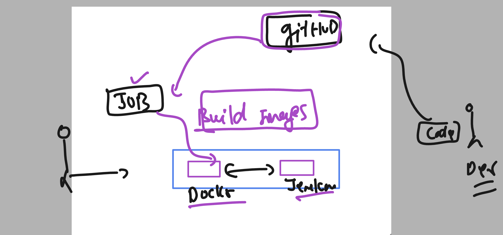

# cloud4c-jenkinsb2

### revision 

```
  51  sudo systemctl status jenkins 
   52  sudo systemctl status docker
   53  history 
[ec2-user@ip-172-31-49-102 ~]$ grep docker  /etc/group
docker:x:991:
[ec2-user@ip-172-31-49-102 ~]$ docker images
Got permission denied while trying to connect to the Docker daemon socket at unix:///var/run/docker.sock: Get "http://%2Fvar%2Frun%2Fdocker.sock/v1.24/images/json": dial unix /var/run/docker.sock: connect: permission denied
[ec2-user@ip-172-31-49-102 ~]$ 
[ec2-user@ip-172-31-49-102 ~]$ 
[ec2-user@ip-172-31-49-102 ~]$ 
[ec2-user@ip-172-31-49-102 ~]$ whoami
ec2-user

```

### Adding non root user to docker group 

```
[ec2-user@ip-172-31-49-102 ~]$ whoami
ec2-user
[ec2-user@ip-172-31-49-102 ~]$ grep docker  /etc/group
docker:x:991:
[ec2-user@ip-172-31-49-102 ~]$ 
[ec2-user@ip-172-31-49-102 ~]$ 
[ec2-user@ip-172-31-49-102 ~]$ sudo usermod -G docker  ec2-user
[ec2-user@ip-172-31-49-102 ~]$ 
[ec2-user@ip-172-31-49-102 ~]$ 
[ec2-user@ip-172-31-49-102 ~]$ grep docker  /etc/group
docker:x:991:ec2-user
[ec2-user@ip-172-31-49-102 ~]$ 
[ec2-user@ip-172-31-49-102 ~]$ 
[ec2-user@ip-172-31-49-102 ~]$ sudo usermod -G docker  jenkins 
[ec2-user@ip-172-31-49-102 ~]$ 
[ec2-user@ip-172-31-49-102 ~]$ grep docker  /etc/group
docker:x:991:ec2-user,jenkins
[ec2-user@ip-172-31-49-102 ~]$ 
[ec2-user@ip-172-31-49-102 ~]$ whoami
ec2-user
[ec2-user@ip-172-31-49-102 ~]$ docker  images
Got permission denied while trying to connect to the Docker daemon socket at unix:///var/run/docker.sock: Get "http://%2Fvar%2Frun%2Fdocker.sock/v1.24/images/json": dial unix /var/run/docker.sock: connect: permission denied
[ec2-user@ip-172-31-49-102 ~]$ 
[ec2-user@ip-172-31-49-102 ~]$ 
[ec2-user@ip-172-31-49-102 ~]$ sudo chmod  777  /var/run/docker.sock  # is only for current access without restart docker
[ec2-user@ip-172-31-49-102 ~]$ 
[ec2-user@ip-172-31-49-102 ~]$ 
[ec2-user@ip-172-31-49-102 ~]$ docker  images
REPOSITORY   TAG       IMAGE ID   CREATED   SIZE
[ec2-user@ip-172-31-49-102 ~]$ docker version 
Client:
 Version:           20.10.23
 API version:       1.41
 Go version:        go1.18.9
 Git commit:        7155243
 Built:             Tue Apr 11 22:56:36 2023
 OS/Arch:           linux/amd64
 Context:           default
 Experimental:      true

Server:
 Engine:
  Version:          20.10.23
  API version:      1.41 (minimum version 1.12)
  Go version:       go1.18.9
  Git commit:       6051f14
  Built:            Tue Apr 11 22:57:17 2023

```

## github and jenkins integration 



