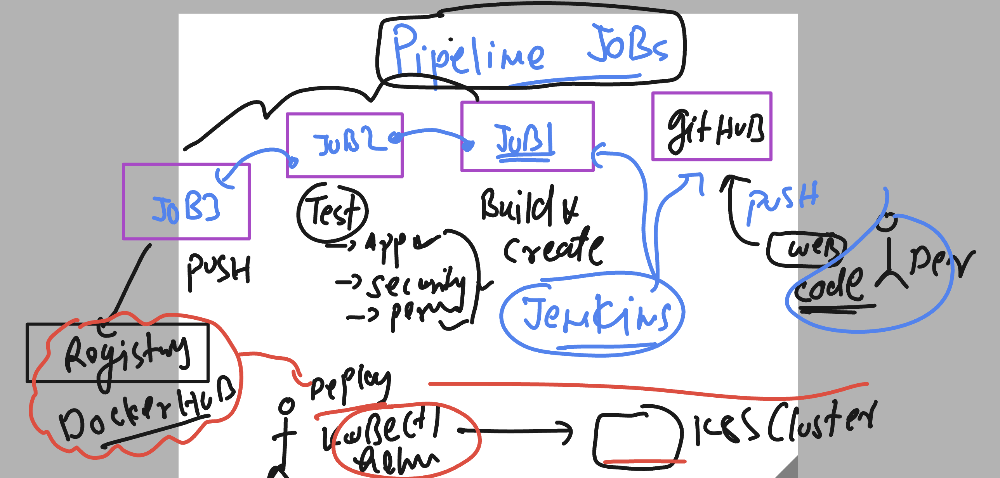
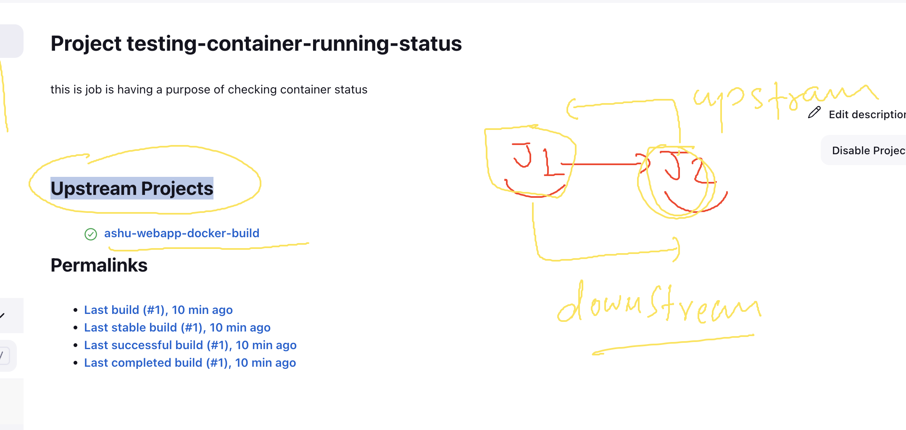
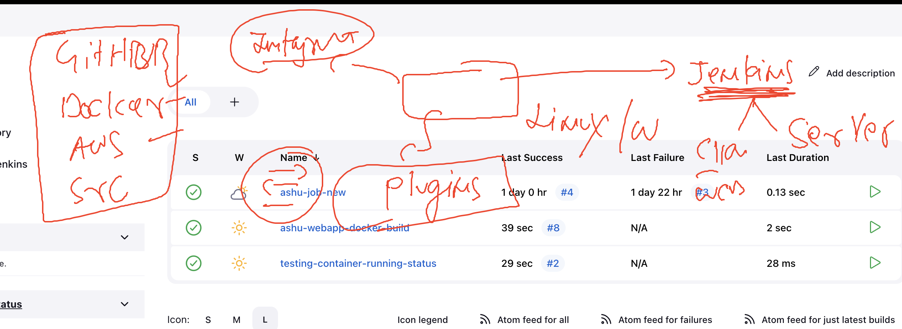
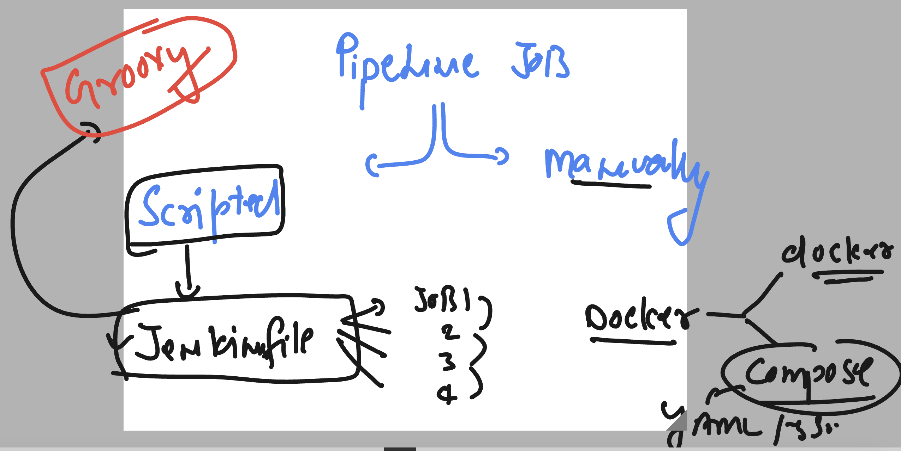

# cloud4c-jenkinsb2

### verify jenkins status

```
[ec2-user@ip-172-31-49-102 ~]$ grep docker  /etc/group
docker:x:991:ec2-user,jenkins
[ec2-user@ip-172-31-49-102 ~]$ systemctl status jenkins
● jenkins.service - Jenkins Continuous Integration Server
   Loaded: loaded (/usr/lib/systemd/system/jenkins.service; enabled; vendor preset: disabled)
   Active: active (running) since Thu 2023-06-22 11:38:08 UTC; 4min 43s ago
 Main PID: 3050 (java)


===>

```

### verify docker 

```
[ec2-user@ip-172-31-49-102 ~]$ systemctl status docker
● docker.service - Docker Application Container Engine
   Loaded: loaded (/usr/lib/systemd/system/docker.service; enabled; vendor preset: disabled)
   Active: active (running) since Thu 2023-06-22 11:37:54 UTC; 5min ago
     Docs: https://docs.docker.com
  Process: 3281 ExecStartPre=/usr/libexec/docker/docker-setup-runtimes.sh (code=exited, status=0/SUCCESS)
  Process: 3275 ExecStartPre=/bin/mkdir -p /run/docker (code=exited, status=0/SUCCESS)
 Main PID: 3293 (dockerd)

```

## More info about jenkins 

```
[root@ip-172-31-49-102 ~]# grep jenkins  /etc/passwd
jenkins:x:995:993:Jenkins Automation Server:/var/lib/jenkins:/bin/false
[root@ip-172-31-49-102 ~]# 
[root@ip-172-31-49-102 ~]# 
[root@ip-172-31-49-102 ~]# cd  /var/lib/jenkins/
[root@ip-172-31-49-102 jenkins]# ls
%C                                jenkins.install.InstallUtil.lastExecVersion     nodes                                               secrets
config.xml                        jenkins.install.UpgradeWizard.state             org.jenkinsci.plugins.gitclient.JGitApacheTool.xml  updates
hudson.model.UpdateCenter.xml     jenkins.model.JenkinsLocationConfiguration.xml  org.jenkinsci.plugins.gitclient.JGitTool.xml        userContent
hudson.plugins.git.GitTool.xml    jenkins.mvn.GlobalMavenConfig.xml               plugins                                             users
hudson.plugins.gradle.Gradle.xml  jenkins.telemetry.Correlator.xml                queue.xml                                           workspace
hudson.tasks.Ant.xml              jobs                                            queue.xml.bak
hudson.tasks.Maven.xml            logs                                            secret.key
identity.key.enc                  nodeMonitors.xml                                secret.key.not-so-secret
[root@ip-172-31-49-102 jenkins]# ls jobs/
ashu-job-new  ashu-webapp-docker-build
[root@ip-172-31-49-102 jenkins]# cd  jobs/
[root@ip-172-31-49-102 jobs]# ls
ashu-job-new  ashu-webapp-docker-build
[root@ip-172-31-49-102 jobs]# cd  ashu-webapp-docker-build/
[root@ip-172-31-49-102 ashu-webapp-docker-build]# ls
builds  config.xml  nextBuildNumber  scm-polling.log
[root@ip-172-31-49-102 ashu-webapp-docker-build]# ls builds/
1  2  3  4  5  6  legacyIds  permalinks
[root@ip-172-31-49-102 ashu-webapp-docker-build]# 
```

### more details about jenkins job data

```
[root@ip-172-31-49-102 ashu-webapp-docker-build]# cd  /var/lib/jenkins/
[root@ip-172-31-49-102 jenkins]# ls
%C                                jenkins.install.InstallUtil.lastExecVersion     nodes                                               secrets
config.xml                        jenkins.install.UpgradeWizard.state             org.jenkinsci.plugins.gitclient.JGitApacheTool.xml  updates
hudson.model.UpdateCenter.xml     jenkins.model.JenkinsLocationConfiguration.xml  org.jenkinsci.plugins.gitclient.JGitTool.xml        userContent
hudson.plugins.git.GitTool.xml    jenkins.mvn.GlobalMavenConfig.xml               plugins                                             users
hudson.plugins.gradle.Gradle.xml  jenkins.telemetry.Correlator.xml                queue.xml                                           workspace
hudson.tasks.Ant.xml              jobs                                            queue.xml.bak
hudson.tasks.Maven.xml            logs                                            secret.key
identity.key.enc                  nodeMonitors.xml                                secret.key.not-so-secret
[root@ip-172-31-49-102 jenkins]# cd  workspace/
[root@ip-172-31-49-102 workspace]# ls
ashu-job-new  ashu-job1  ashu-webapp-docker-build
[root@ip-172-31-49-102 workspace]# cd ashu-webapp-docker-build/
[root@ip-172-31-49-102 ashu-webapp-docker-build]# ls
Dockerfile  README.md  cicd.png  docker-compose.yaml  health.html  index.html
[root@ip-172-31-49-102 ashu-webapp-docker-build]# 


```

## pipeline jobs in jenkins



### configuration of downloadstream or upstream projects 



### Introduction to plugins in jenkins 



## Introduce jenkins for scripted job building and pipeline creation 



### running jenkins as container

```
root@ip-172-31-49-102 jenkins]# docker pull jenkins/jenkins:lts-jdk11
lts-jdk11: Pulling from jenkins/jenkins
bd73737482dd: Extracting [===============================================>   ]  52.36MB/55.05MB
747b9186aa97: Download complete 


=====>
root@ip-172-31-49-102 jenkins]# docker  volume  create  jenkins-data
jenkins-data
[root@ip-172-31-49-102 jenkins]# docker run -itd --name jenkinsc1 -p 8080:8080  --restart always -v jenkins-data:/var/jenkins_home/ jenkins/jenkins:lts-jdk11   
9db19ede0ed8f668e75b9b2a8fefb3d8961fde29780d53a910830e1d505b09f2
[root@ip-172-31-49-102 jenkins]# docker ps
CONTAINER ID   IMAGE                       COMMAND                  CREATED          STATUS          PORTS                                                  NAMES
9db19ede0ed8   jenkins/jenkins:lts-jdk11   "/usr/bin/tini -- /u…"   3 seconds ago    Up 2 seconds    0.0.0.0:8080->8080/tcp, :::8080->8080/tcp, 50000/tcp   jenkinsc1
92d3aa5ad376   ashu-web:app9               "/docker-entrypoint.…"   22 minutes ago   Up 22 minutes   0.0.0.0:1234->80/tcp, :::1234->80/tcp                  ashuc1
[root@ip-172-31-49-102 jenkins]# docker  logs jenkinsc1


```
