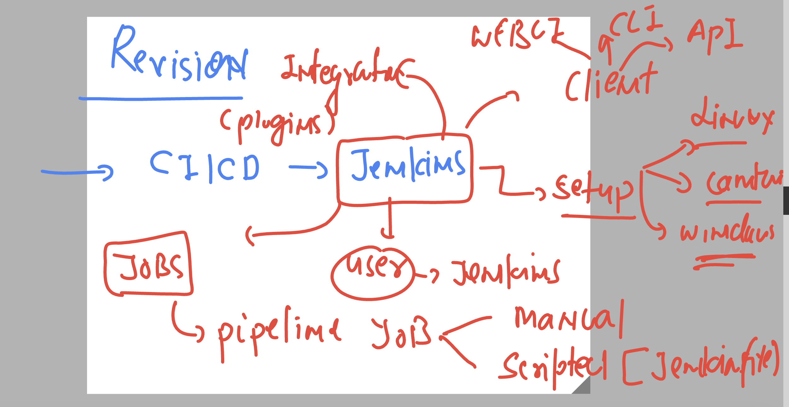
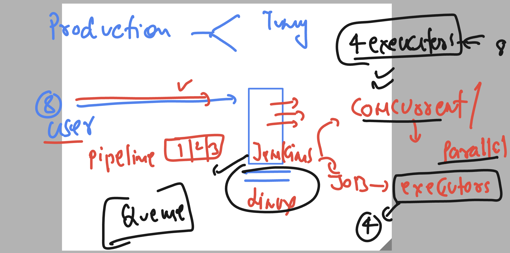
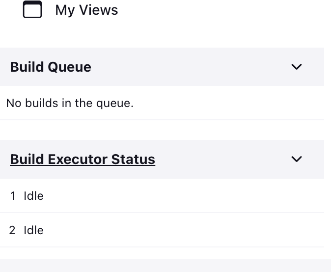
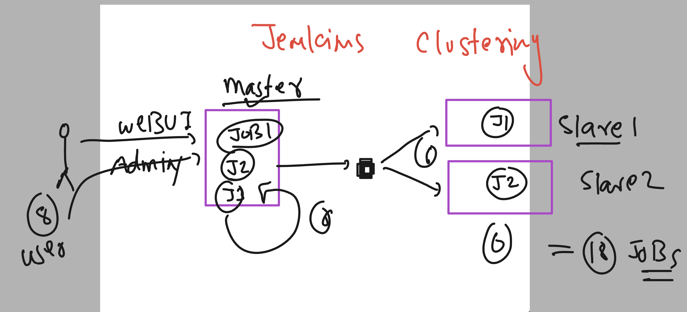
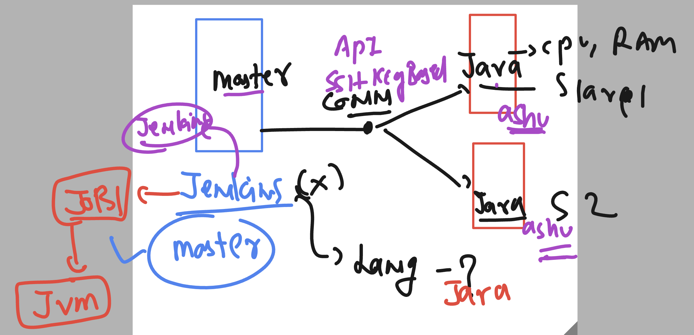

# cloud4c-jenkinsb2
## Revision 



### Executors 



### cpu relation with jenkins executors 

### checking cpu core 

```
[root@ip-172-31-49-102 ~]# lscpu 
Architecture:        x86_64
CPU op-mode(s):      32-bit, 64-bit
Byte Order:          Little Endian
CPU(s):              2
On-line CPU(s) list: 0,1
```

### checking number of executor 



### changing executors

```
[root@ip-172-31-49-102 jenkins]# pwd
/var/lib/jenkins
[root@ip-172-31-49-102 jenkins]# vim config.xml 
[root@ip-172-31-49-102 jenkins]# systemctl restart jenkins
[root@ip-172-31-49-102 jenkins]# grep -i executor  config.xml 
    <string>jenkins.diagnostics.ControllerExecutorsNoAgents</string>
  <numExecutors>4</numExecutors>

```
### understanding jenkisn cluster concept



### more details about clustering 



# configure slave machines 

### Installing jdk 8 or later version 

```
ip-172-31-28-117 ~]# amazon-linux-extras install java-openjdk11 -y
Installing java-11-openjdk
Failed to set locale, defaulting to C
Loaded plugins: extras_suggestions, langpacks, priorities, update-motd
Cleaning repos: amzn2-core amzn2extra-docker amzn2extra-java-openjdk11 amzn2extra-kernel-5.10
17 metadata files removed
6 sqlite files removed
0 metadata files removed


======> Verify jdk version
[root@ip-172-31-28-117 ~]# java -version 
openjdk version "11.0.19" 2023-04-18 LTS
OpenJDK Runtime Environment (Red_Hat-11.0.19.0.7-1.amzn2.0.1) (build 11.0.19+7-LTS)
OpenJDK 64-Bit Server VM (Red_Hat-11.0.19.0
```

### creating user with some password and allow password auth in ssh 

```
[root@ip-172-31-28-117 ~]# useradd ashu
[root@ip-172-31-28-117 ~]# echo "Redhat@098"  | passwd ashu --stdin 
Changing password for user ashu.
passwd: all authentication tokens updated successfully.
[root@ip-172-31-28-117 ~]# vim +63  /etc/ssh/sshd_config 
[root@ip-172-31-28-117 ~]# systemctl restart sshd
[root@ip-172-31-28-117 ~]# 

```


## COnfigure jenkins master to connect slave with ssh-key 

```
[root@ip-172-31-49-102 ~]# grep jenkins  /etc/passwd
jenkins:x:995:993:Jenkins Automation Server:/var/lib/jenkins:/bin/false
[root@ip-172-31-49-102 ~]# 
[root@ip-172-31-49-102 ~]# 
[root@ip-172-31-49-102 ~]# usermod -s /bin/bash jenkins 
[root@ip-172-31-49-102 ~]# 
[root@ip-172-31-49-102 ~]# grep jenkins  /etc/passwd
jenkins:x:995:993:Jenkins Automation Server:/var/lib/jenkins:/bin/bash
[root@ip-172-31-49-102 ~]# 
[root@ip-172-31-49-102 ~]# 
[root@ip-172-31-49-102 ~]# su - jenkins 
-bash-4.2$ 
-bash-4.2$ whoami
jenkins
-bash-4.2$ pwd
/var/lib/jenkins
-bash-4.2$ ssh-keygen 
Generating public/private rsa key pair.
Enter file in which to save the key (/var/lib/jenkins/.ssh/id_rsa): 
Created directory '/var/lib/jenkins/.ssh'.
Enter passphrase (empty for no passphrase): 
Enter same passphrase again: 
Your identification has been saved in /var/lib/jenkins/.ssh/id_rsa.
Your public key has been saved in /var/lib/jenkins/.ssh/id_rsa.pub.
The key fingerprint is:
SHA256:a+yxKg2MB/dTChPRtn+SISt8aIwMFag3I/AwCbeWQw0 jenkins@ip-172-31-49-102.ec2.internal
The key's randomart image is:
+---[RSA 2048]----+
|ooE+.o           |
|*o.oo o          |
|o==  o .         |
|+.*.+ o o        |
| = @ = *So       |
|  + X *.+..      |
|   o = .=o       |
|    . .o o       |
|     ...o        |
+----[SHA256]-----+
-bash-4.2$ ssh-copy-id  ashu@172.31.28.117
/usr/bin/ssh-copy-id: INFO: Source of key(s) to be installed: "/var/lib/jenkins/.ssh/id_rsa.pub"
The authenticity of host '172.31.28.117 (172.31.28.117)' can't be established.
ECDSA key fingerprint is SHA256:97BD/uPVeu0aRtUpEVOMSdEhiKLOSD5CTfnSoTJ0PsI.
ECDSA key fingerprint is MD5:41:46:11:98:85:52:76:e9:31:54:b3:4c:f7:e3:ce:1e.
Are you sure you want to continue connecting (yes/no)? yes
/usr/bin/ssh-copy-id: INFO: attempting to log in with the new key(s), to filter out any that are already installed
/usr/bin/ssh-copy-id: INFO: 1 key(s) remain to be installed -- if you are prompted now it is to install the new keys
ashu@172.31.28.117's password: 

Number of key(s) added: 1

Now try logging into the machine, with:   "ssh 'ashu@172.31.28.117'"
and check to make sure that only the key(s) you wanted were added.


```

