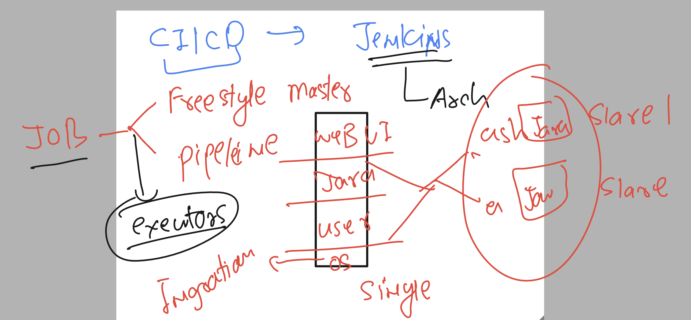
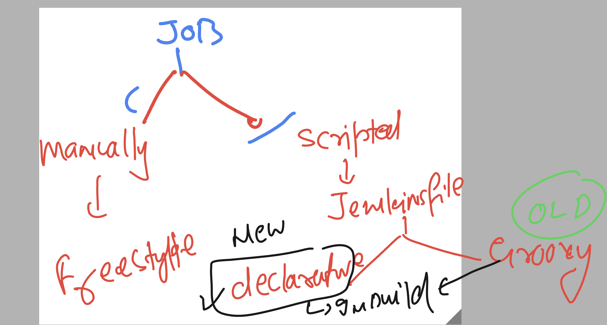
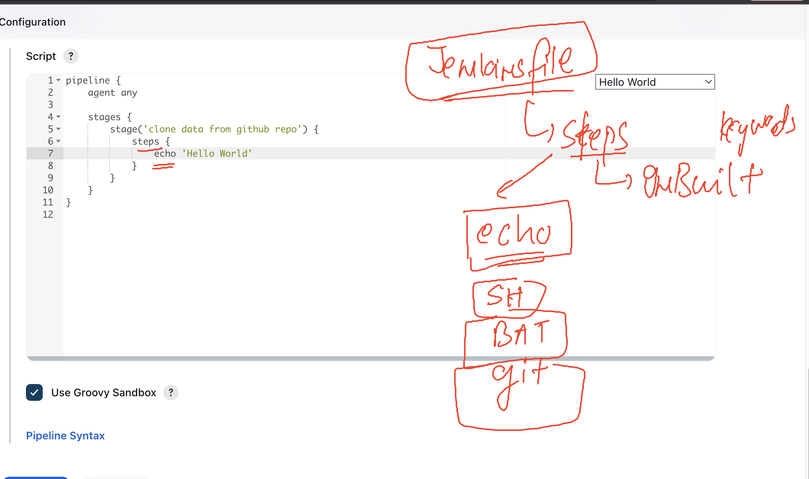

# cloud4c-jenkinsb2

### Revision 



### Revision of jenkinsfile 



### in declarative jenkinsfile method we have some built-in keywords 



### jenkinsfile with single stage

```
pipeline {
    agent any

    stages {
        stage('clone data from github repo') {
            steps {
                // echo is inbuild keyword support under steps 
                echo 'gonna take source from Github Repo'
                // taking data from github 
                git 'https://github.com/redashu/ashu-cisco-webUI.git'
                // we can run command in host os where jenkins is running
                // sh is keyword for linux host and bat is keyword for windows host os
                sh 'ls'
                
            }
        }
    }
}

```

### adding a new stage in jenkinsfile

```
pipeline {
    agent any

    stages {
        stage('clone data from github repo') {
            steps {
                // echo is inbuild keyword support under steps 
                echo 'gonna take source from Github Repo'
                // taking data from github 
                git 'https://github.com/redashu/ashu-cisco-webUI.git'
                // we can run command in host os where jenkins is running
                // sh is keyword for linux host and bat is keyword for windows host os
                sh 'ls'
                
            }
        }
        stage('build docker image and container') {
            steps {
                echo 'Using docker-compose to do the process'
                // calling compose file 
                sh 'docker-compose down'
                sh 'docker-compose up -d --build'
                // checking container
                sh 'docker-compose ps'
                // checking images
                sh 'docker images'
            }
            
        }
    }
}

```
