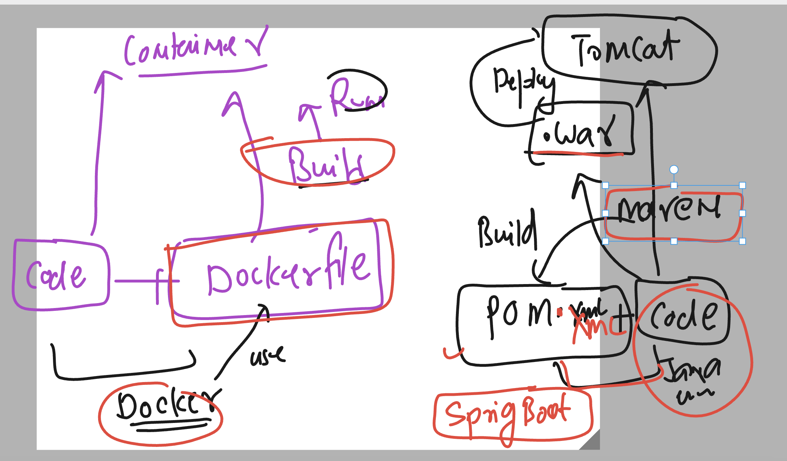

# cloud4c-jenkinsb2

### understanding maven based java project build env



### installing jdk8 with maven in slave 1 only 

```
 yum install java-1.8.0-openjdk.x86_64  java-1.8.0-openjdk-devel.x86_64
yum install maven 
```

### creating jenkinsfile with maven build

```
pipeline {
    // planing to run this job on slave 1 only 
    agent {
        label 'slave1'
    }

    stages {
        stage('for cloning java project from github') {
            steps {
                echo 'we are cloning git repo'
                // using git internal keyword in pipeline
                git 'https://github.com/redashu/java-springboot.git'
                // verify it 
                sh 'ls'
            }
        }
        stage('using maven to build this in war file'){
            steps {
                echo 'please wait we are trying to build maven package'
                // using shell command 
                sh 'mvn clean package'
                // verify target folder
                sh 'ls target'
            }
        }
    }
    post {
        success {
            echo 'hey we did it'
        }
        failure {
            echo 'we can try again we still have way to go'
        }
    }
}

```

### No chnages on the node -- Dockerfile to do all the things in docker image build

```
FROM oraclelinux:8.4
LABEL name=ashutoshh
RUN dnf install java-1.8.0-openjdk.x86_64  java-1.8.0-openjdk-devel.x86_64  maven git -y 
RUN mkdir /ashu-java
WORKDIR /ashu-java
RUN git clone https://github.com/redashu/java-springboot.git 
WORKDIR java-springboot
# now running maven to create .war file 
RUN mvn clean package
```

### jenkinsfile with maven + dockerfile

```
pipeline {
    // planing to run this job on any random node
    agent any 

    stages {
        stage('for cloning java project from github') {
            steps {
                echo 'we are cloning git repo'
                // using git internal keyword in pipeline
                git 'https://github.com/redashu/java-springboot.git'
                // verify it 
                sh 'ls'
            }
        }
        stage('using maven to build this in war file by docker '){
            steps {
                echo 'please wait we are trying to build maven package using docker'
                // using shell command of docker
                sh 'docker build -t ashu-java:app$BUILD_NUMBER .'
                // verify docker image
                sh 'docker images | grep ashu-java'
            }
        }
    }
    post {
        success {
            echo 'hey we did it'
        }
        failure {
            echo 'we can try again we still have way to go'
        }
    }
}

```

### jenkinsfile with docker internal jenkins support with pipeline jobs

```
pipeline {
    // planing to run this job on any random node
    agent any 

    stages {
        stage('for cloning java project from github') {
            steps {
                echo 'we are cloning git repo'
                // using git internal keyword in pipeline
                git 'https://github.com/redashu/java-springboot.git'
                // verify it 
                sh 'ls'
            }
        }
        stage('using maven to build into war file by docker plugins '){
            steps {
                echo 'please wait we are trying to build maven package using docker'
                // using script feature
                script {
                    def myimg = "ashu-javaweb"
                    def myimgtag = "version$BUILD_NUMBER"
                    // calling docker function for image build
                    docker.build(myimg + ":" + myimgtag, "-f Dockerfile .")
                }
                // verify 
                sh  'docker images | grep ashu'
               
            }
        }
    }
    post {
        success {
            echo 'hey we did it'
        }
        failure {
            echo 'we can try again we still have way to go'
        }
    }
}


```


