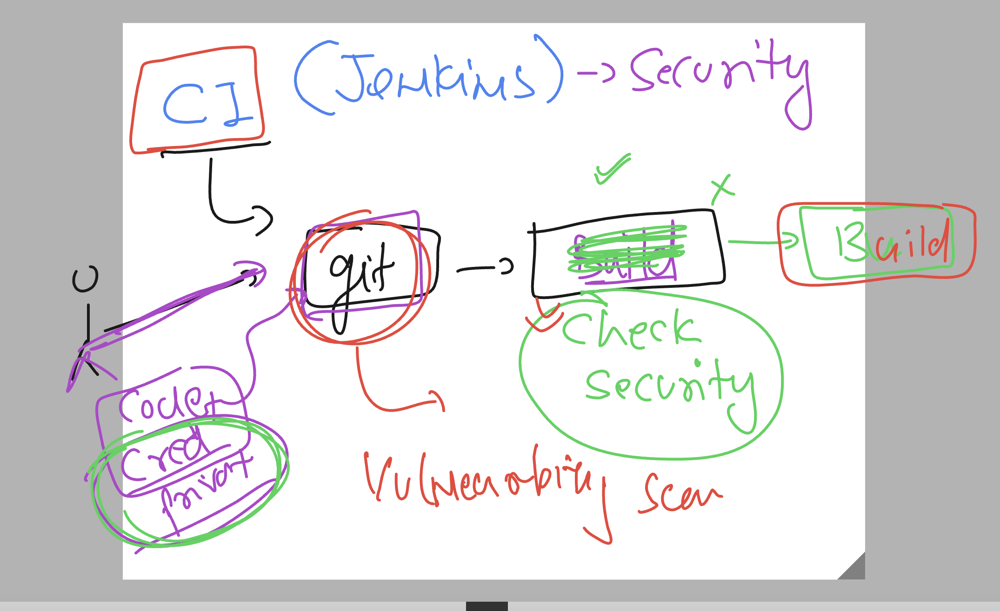

# cloud4c-jenkinsb2

### Adjusting security analysis



### jenkinsfile for detecting private key

```
pipeline {
    agent any

    stages {
        stage('cloning github source code') {
            steps {
                echo 'taking sample code to tesing'
                git 'https://github.com/redashu/ashu-cisco-webUI.git'
                // when we run any shell command it return exit code 0 on success 
                // verification also 
                sh 'ls | grep html'
            }
        }
        stage('doing SAST using trufflehog'){
            steps {
                echo 'using trufflehog to test private key presence'
                // using docker based truffleHog 
                sh ' docker run -it --rm  trufflesecurity/trufflehog:latest  github --repo https://github.com/redashu/ashu-cisco-webUI.git --json     >testkey.txt'
                // checking presence
                sh 'cat testkey.txt | grep -i private'
            }
        }
    }
}

```

### adding docker pipeline build method

```
pipeline {
    agent any

    stages {
        stage('cloning github source code') {
            steps {
                echo 'taking sample code to tesing'
                git 'https://github.com/redashu/ashu-cisco-webUI.git'
                // when we run any shell command it return exit code 0 on success 
                // verification also 
                sh 'ls | grep html'
            }
        }
        stage('doing SAST using trufflehog'){
            steps {
                echo 'using trufflehog to test private key presence'
                // using docker based truffleHog 
                sh ' docker run --rm  trufflesecurity/trufflehog:latest  github --repo https://github.com/redashu/ashu-cisco-webUI.git --json     >testkey.txt'
                // checking presence
                sh 'cat testkey.txt | grep -i private '
                sh 'exit 0'
            }
        }
        // building docker image using docker pipeline
        stage('building image'){
            steps {
                echo 'usign docker pipeline to build image'
                script {
                    def imageName = "dockerashu/ashusec"
                    def imageTag  = "version$BUILD_NUMBER"
                    // docker build function 
                    docker.build(imageName + ":" + imageTag, " -f Dockerfile .")
                }
                // verify image
                sh 'docker images  | grep ashusec'
            }
        }
    }
}

```


